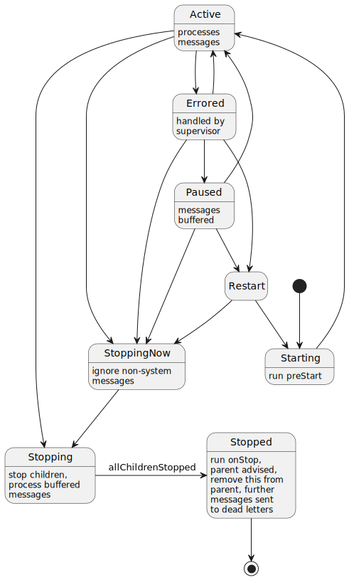
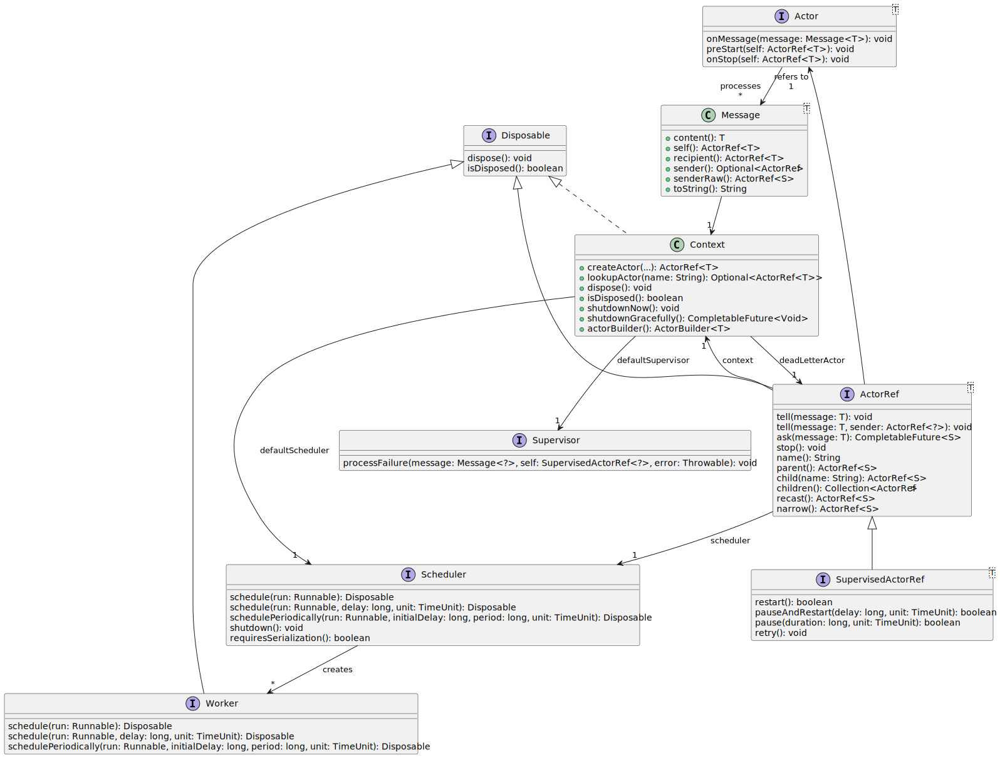

# reels
<a href="https://github.com/davidmoten/reels/actions/workflows/ci.yml"></a><br/>
[](https://codecov.io/gh/davidmoten/reels)<br/>
[](https://maven-badges.herokuapp.com/maven-central/au.gov.amsa/reels)<br/>

Actor framework for Java, non-blocking, performant. Developed as a reaction to the Akka licence change. Akka is a huge framework with a large number of extensions including persistence, web serving, streaming and more. My needs are limited to the core of Akka, namely in-memory actor support (including supervision) and that's what this library provides.

Why would you trust this library with plenty of concurrency-sensitive code? I've been involved in concurrency-sensitive projects since 2014 as a frequent contributor to RxJava 1.x and the author of numerous popular RxJava libraries (rxjava-extras, rxjava-jdbc, rxjava3-pool, rxjava-slf4j, rxjava-http, rxjava-aws). All these libraries involve a lot of concurrency-aware and performance-aware work so this is not new ground for me. Please raise an issue if you spot something.

Why do we need another Actor library on the JVM? I think there's space for an in-memory Actor library that has a small footprint (only dependency is *slf4j-api* for logging and jar is ~100K), is easy to use (the API is both simple and discoverable), offers a goodly number of useful features, and is thread-safe and performant.

## Features
* Discoverable concise API (Akka is not, partly due to the way it's evolved and a lot of Scala library stuff)
* Custom supervisors including the ability to retry processing later and/or restart the actor (recreate the Actor object)
* Parent-child actor hierarchies
* Dead letter actor
* SLF4J logging (add the implementation that you like)
* Akka stop semantics (stopping an actor stops its children first)
* Jar size 100K with only one logging dependency (slf4j)
* Built and tested with JDK 8, 11, 17
 
**Status:** *Published to Maven Central*

TODO 
* Lifecycle monitoring (DeathWatch) support. Later.
* Add Actor.preRestart, Actor.postRestart methods? Jury still out on this. NO
* Akka has a kill method that forces onMessage to throw an ActorKilledException. Not keen on this. NO

## How to build
```bash
mvn clean install
```

## Getting started
Add this dependency to your pom.xml:
```xml
<dependency>
  <groupId>com.github.davidmoten</groupId>
  <artifactId>reels</artifactId>
  <version>VERSION_HERE</version>
</dependency><
```
## Glossary
For background about the Actor Model see this wikipedia [article](https://en.wikipedia.org/wiki/Actor_model).

**Actor**

An Actor is an object (with a chunk of message processing logic) that reacts to messages that are sent to it and communicates with other Actors via asynchronous messsaging. An Actor can have private state and has the simplification that messages sent to it are processed in-order so concurrency issues don't need to be considered. Concurrent/Parallel aspects of a system are modelled via asynchronous messages between Actors. An Actor has a lifecycle, and can be restarted (recreated) by a Supervisor.

**ActorRef**

An ActorRef is a reference to an Actor and is how one programmatically interacts with an Actor. The referred Actor object is not directly accesible and in fact may be replaced over time if a Supervisor restarts the Actor. 

**Context**

A Context (ActorSystem in Akka) is used to create and own Actors in a heirarchy (which can be flat), handle dead messages, and shutdown all its owned Actors in a controlled manner.

**Mailbox**

When a message is sent to an Actor it is placed in a Mailbox (queue) where it waits its turn to be processed by the Actor onMessage method. Mailboxes can be of various types and are customizable. For example a Mailbox can be unbounded in size (so buffered messages growth is only limited by available memory), bounded in size, or supported by a PriorityQueue.

**Message**

The chunk of information that flies around between Actors is a Message and is comprised of content and a sender ActorRef (optional). The reels API also makes available the message recipient ActorRef (self) and Context in the call to Actor.onMessage (Akka exposes those things as functions on `this`).

**Scheduler**

Based on Executors of various kinds Schedulers allow work (Runnable) to be submitted to run now (once a worker thread available) or in the future. Schedulers (and queues) are the basis for asynchronous messaging between Actors.

**Supervisor**

When an Actor throws from its processing methods the error is caught by a Supervisor. Within the Supervisor the ActorRef for the Actor is supplemented with extra methods to be able to restart, restart with a delay or pause an Actor for a period. A minimal Supervisor might just log the failure and allow message processing to continue, or Actor state might be reset via restart, or the Actor might be stopped. Up to you.

**SupervisedActorRef**

When the ActorRef is passed to the Supervisor it is wrapped as a SupervisedActorRef which supplements the ActorRef with methods to restart, restart with a delay or pause the Actor. The aim is that this sort of interaction with an Actor should only happen in the Supervisor (in a fault-recovery scenario).

**Worker**

A Scheduler can create a Worker which has scheduling methods but has a lifespan (controlled by calling the `dispose` method). Every ActorRef has a Worker for scheduling in-order processing of messages. A Scheduler (like the `io()` Scheduler) might offer a unique thread with each Worker so disposal allows for recovery of that thread for use by other Workers. 

## Actor Lifecycle UML State Diagram



## Reels UML Class Diagram



## Usage

### Create a Context
* Create a `Context` (`ActorSystem` in Akka) object to create your actors and control their lifecycle
* `Scheduler`s (`Dispatcher`s in Akka) live outside your `Context` object and thus can be shared across `Context`s (for greater efficiency))

The simplest way to create a `Context` object is:

```java
Context context = Context.create();
```

You can use a builder to configure the `Context`:
```java
Context context = Context
  .builder()
  .supervisor(supervisor)
  .deadLetterActorFactory(factory)
  .scheduler(scheduler)
  .build();
```
### Create an Actor using matchers
Now use a `Context` to create typed Actors:

```java
Context context = Context.create();
ActorRef<String> a = context.matchAny(m -> System.out.println(m.content())).build();
a.tell("hi there");
Thread.sleep(1000);
```

`ActorRef.tell` is asynchronous (with the default scheduler) so we wait with `Thread.sleep` to see something happen. The result of course is that 
"hi there" will be written to the console and it will generally happen on a different thread to the call of `tell`.

Here's a "kitchen sink" example that demonstrates many options when creating actors:
```java
Context context = Context.create();

// create a parent actor (you can setup heirarchies) using a builder
ActorRef<Number> a = context 
    .<Number>matchAny(m -> {
        log.info("{}: parent received {}", m.self(), m.content());
        m.self().child("b").tell(m.content(), m.self());
    }) 
    .name("a") 
    .scheduler(Scheduler.single()) 
    .onStop(self -> log.info("{}: onStop", self)) 
    .build();

// create a child actor of `a` using a builder
context 
    // specify a series of matches to apply to incoming message content
    .<Number>matchEquals(1, m -> {
        log.info("{}: equal matched, sender = {}", m.self(), m.sender());
        m.sender().<Number>tell(9999));
    }) 
    .match(Integer.class, m -> log.info("{}: received integer {}", m.self(), m.content())) 
    .match(Double.class, m -> log.info("{}: received double {}", m.self(), m.content())) 
    .matchAny(m -> log.info("{}: received something else {}", m.self(), m.content())) 
    .name("b") 
    .onError(e -> log.error(e.getMessage(), e)) 
    .preStart(self -> log.info("{}: preStart", self)) 
    .onStop(self -> log.info("{}: onStop", self)) 
    .scheduler(Scheduler.computation()) 
    .parent(a) 
    .mailboxFactory(Mailbox.bounded(1000, true))
    .supervisor((m, actor, e) -> {
        log.error(e.getMessage(), e);
        actor.pause(30, TimeUnit.SECONDS);
        actor.retry();
    }) 
    .build();

a.tell(1);
a.tell(2);
a.tell(3.5);
a.tell(4f);

// give enough time to run (especially for b to respond to `a.tell(1)`
Thread.sleep(500);
context.shutdownGracefully().get(5000, TimeUnit.SECONDS);
```

Output:
```
2022-10-07T21:47:28:055 +1100 [ReelsSingle-1] INFO com.github.davidmoten.reels.ActorTest - a: parent received 1
2022-10-07T21:47:28:057 +1100 [ReelsSingle-1] INFO com.github.davidmoten.reels.ActorTest - a: parent received 2
2022-10-07T21:47:28:057 +1100 [ReelsComputation-1] INFO com.github.davidmoten.reels.ActorTest - b: preStart
2022-10-07T21:47:28:057 +1100 [ReelsComputation-1] INFO com.github.davidmoten.reels.ActorTest - b: equal matched, sender = Optional[a]
2022-10-07T21:47:28:058 +1100 [ReelsComputation-1] INFO com.github.davidmoten.reels.ActorTest - b: received integer 2
2022-10-07T21:47:28:059 +1100 [ReelsSingle-1] INFO com.github.davidmoten.reels.ActorTest - a: parent received 3.5
2022-10-07T21:47:28:059 +1100 [ReelsSingle-1] INFO com.github.davidmoten.reels.ActorTest - a: parent received 4.0
2022-10-07T21:47:28:059 +1100 [ReelsComputation-1] INFO com.github.davidmoten.reels.ActorTest - b: received double 3.5
2022-10-07T21:47:28:060 +1100 [ReelsSingle-1] INFO com.github.davidmoten.reels.ActorTest - a: parent received 9999
2022-10-07T21:47:28:060 +1100 [ReelsComputation-1] INFO com.github.davidmoten.reels.ActorTest - b: received something else 4.0
2022-10-07T21:47:28:060 +1100 [ReelsComputation-1] INFO com.github.davidmoten.reels.ActorTest - b: received integer 9999
2022-10-07T21:47:28:562 +1100 [ReelsComputation-1] INFO com.github.davidmoten.reels.ActorTest - b: onStop
2022-10-07T21:47:28:564 +1100 [ReelsSingle-1] INFO com.github.davidmoten.reels.ActorTest - a: onStop
```

#### A warning about using lambdas to create actors
Note that if you use a lambda and you make a reference to the enclosing class then the ActorRef will retain a reference to the enclosing object. We should be careful about this because that referred object will not be garbage collected till the ActorRef is. Consequently, if you create an actor from another actor then you should be conscious about this lifecycle link.

### Create an Actor using your own class

You can also create an Actor class yourself instead of using the builder. Implement `Actor<T>` or extend `AbstractActor<T>`. Suppose you create a class called `MyActor` which extends `AbstractActor<Integer>`. You can create an ActorRef for this class with the Context as follows:

```java
ActorRef<Integer> actor = context.actorClass(MyActor.class).build();
```
or
```java
ActorRef<Integer> actor = context.actorFactory(() -> new MyActor()).build();
```

Note that you can also use the actorClass builder method with constructor arguments too:
```java
ActorRef<Integer> actor = context.actorClass(MyActor.class, "Fred Nurk", 1980).build();
```

## Send a message to an Actor
This sends an anonymous message (the Actor wil be supplied ActorRef.none() as the sender) to an actor:

```java
ActorRef<Thing> actor = ...
Thing thing = ...
actor.tell(thing);
```
To include a sender actor (for example as a reply-to actor):
```java
ActorRef<Thing> actor = ...
ActorRef<Object> replyTo = ...
Thing thing = ...
actor.tell(thing, replyTo);
```

## ask

Here's an example of `ask` where an actor does some calculation and returns an answer asynchronously (via a `CompletableFuture`):

```java
ActorRef<Integer> square = 
    context
      .<Integer>matchAny(m -> m.reply(m.content() * m.content())
      .build();
square
  .ask(23)
  .thenAccept(System.out::println)
  .join();
```
Output:
```
529
```

## Supervisors
When an error is thrown by your code in onMessage you have two options:
* catch and handle the error in-place and reset state as appropriate
* handle the error in a Supervisor, which has more functionality including the ability to restart (recreate the Actor instance), pause processing, and retry a message.

For example, a Supervisor for some JDBC work can check if the thrown exception is an instance of SQLTransientException and mark the message for a retry after a pause. 
If the thrown exception is an instance of SQLNonTransientConnectionException then we should retry with a new connection object. This [unit test](src/test/java/com/github/davidmoten/reels/RetryExampleTest.java) demonstrates this example.

If you don't specify your own Supervisor (either globally in the Context or specifically for your Actor) then the [default Supervisor](src/main/java/com/github/davidmoten/reels/internal/supervisor/SupervisorDefault.java) is used.

Note that the Supervisor is called also for errors thrown by `Actor.preStart` and `Actor.onStop`. However, those errors will arrive at the Supervisor wrapped in `PreStartException` and `OnStopException` respectively. 

The default Supervisor for an actor is the Supervisor of its parent.

Supervisors themselves should not throw. If they do TODO.

## Notes

* An Actor is created by a Context object. The Context object has an internal singleton root actor but is the parent for an Actor you create unless you provide it with an explicit parent. 
* When an actor is disposed no more children can be created for it  
* Dispose happens synchronously (the actor and all its children and descendants are disposed before the method returns) 
* Restarting an actor from a supervisor will dispose all that actors children

## Mailboxes
Mailboxes are where messages sent to an actor are buffered for processing. Each ActorRef has its own Mailbox which is essentially a queue that supports `offer` from multiple threads and `poll` from one thread.

Three types of Mailbox factory are provided:
* `MailboxFactory.unbounded()` creates Mailboxes with an unbounded queue
* `MailboxFactory.bounded(maxSize, dropFirst)` creates Mailboxes with bounded queues and defines what strategy to use when the bound is met (drop first or drop last)
* `MailboxFactory.priority(comparator)` creates Mailboxes based on a priority queue

You can create your own Mailbox type by implementing the Mailbox [interface](src/main/java/com/github/davidmoten/reels/Mailbox.java).

## Schedulers
Sending a message to an Actor is normally asynchronous. That is when you call `actorRef.tell(msg)` what happens under the covers is that the message is placed on a concurrent queue for that actor and the actor is notified to process its queue using an executor.

Schedulers wrap executors and are designed to be efficient for particular use cases. Actors obtain a Worker from each Scheduler for the lifetime of the actor. The standard schedulers are 

* `Scheduler.forkjoin()`, a singleton work-stealing pool of threads that is great for general purpose non-blocking work (wins benchmarks pretty handily and became twice as fast between Java 8 and Java 17). The default scheduler.
* `Scheduler.computation()` is an alias for `forkJoin()` and is for non-blocking work
* `Scheduler.computationSticky()`, a singleton pool of threads (size = number of processors) for non-blocking work. A Worker on this pool uses a randomly/round-robin assigned thread from the pool and that thread stays with the Worker till disposal of the Worker (that is a thread *sticks* to an actor). One thread can be in use by many Workers. Normally slower than `forkJoin()`.
* `Scheduler.io()`, a singleton unbounded thread pool designed for blocking work, unused threads are disposed of by an evicting thread after 60s of inactivity. Each Worker has one thread (and each thread in this pool has only one Worker). This scheduler was adapted from RxJava 3.x `Schedulers.io()`.
* `Scheduler.single()`, a singleton scheduler that is based on a single thread executor service
* `Scheduler.newSingle()`, creates a new single-thread-based scheduler
* `Scheduler.fromExecutor(ExecutorService)`, creates a new scheduler based on the given ExecutorService. Use one of these with a pool for blocking work where you have a lot of actors (to limit context switching and thread memory use)
* `Scheduler.test()` is for synchronous unit testing purposes and **should not be mixed with asynchronous scheduler use** in the same Context.
* `Scheduler.immediate()` is for synchronous execution of all tasks, limited delayed scheduling, and **should not be mixed with asynchronous scheduler use** in the same Context
 
## Blocking work

Make sure you use a blocking scheduler (especially `Scheduler.io()`) for any blocking work like database calls, file system IO, network IO.
 
## Memory use
Each actor takes about 600 bytes if you use the `match*` builder methods. (i.e a million actors would take 600MB of memory). My tests show Akka is about 520 bytes per actor. I measured this by running [MemoryUsageMain.java](src/test/java/com/github/davidmoten/reels/MemoryUsageMain.java) and [MemoryUsageAkkaMain.java](src/test/java/com/github/davidmoten/reels/MemoryUsageAkkaMain.java) and used jconsole to force gc and check memory usage. 

If the actor is created with `context.actorClass(...)` then each actor takes about 450 bytes.

## Benchmarks
To run benchmarks:

```bash
mvn clean install -P benchmark
```

Benchmarking indicates that reels is faster than Akka for four aspects tested:

* ask performance (15% faster)
* hub and spoke contended performance (3x faster)
* random messages around a ring performance, some contention, uses actor lookups (5x faster)
* long sequential chain then return (8x faster)

Using JDK 17 on i5-6200U with 4 cores:
```
Benchmark                                          Mode  Cnt       Score     Error  Units
Benchmarks.actorCreateAndStop                     thrpt   10  251437.893 ± 449.575  ops/s
Benchmarks.ask                                    thrpt   10       8.063 ±   0.018  ops/s
Benchmarks.contendedConcurrencyComputationSticky  thrpt   10       0.763 ±   0.050  ops/s
Benchmarks.contendedConcurrencyForkJoin           thrpt   10       6.028 ±   0.248  ops/s
Benchmarks.contendedConcurrencyImmediate          thrpt   10      10.072 ±   0.099  ops/s
Benchmarks.groupRandomMessagesComputationSticky   thrpt   10       1.958 ±   0.045  ops/s
Benchmarks.groupRandomMessagesForkJoin            thrpt   10      17.947 ±   0.694  ops/s
Benchmarks.groupRandomMessagesImmediate           thrpt   10      32.813 ±   0.616  ops/s
Benchmarks.groupRandomMessagesIo                  thrpt   10       0.867 ±   0.019  ops/s
BenchmarksAkka.ask                                thrpt   10       6.978 ±   0.293  ops/s
BenchmarksAkka.contendedConcurrency               thrpt   10       1.641 ±   0.105  ops/s
BenchmarksAkka.groupRandomMessages                thrpt   10       3.711 ±   0.055  ops/s
Benchmarks.sequential                                ss   10       1.951 ±   0.326   s/op
BenchmarksAkka.sequential                            ss   10      20.868 ±   0.478   s/op
```


