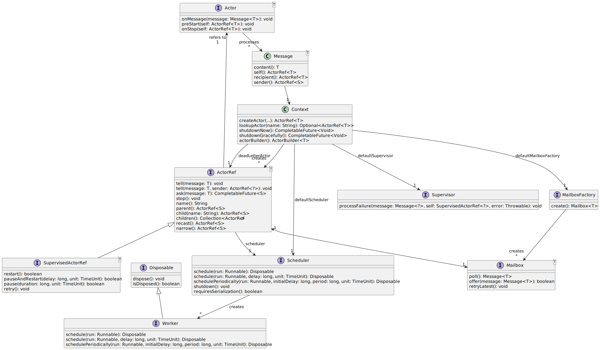

# reels
<a href="https:github.com/davidmoten/reels/actions/workflows/ci.yml"></a><br/>
[](https:codecov.io/gh/davidmoten/reels)<br/>
[](https:maven-badges.herokuapp.com/maven-central/au.gov.amsa/reels)<br/>

Actor framework for Java, non-blocking, performant. Developed as a reaction to the Akka licence change. Akka is a huge framework with a large number of extensions including persistence, web serving, streaming and more. My needs are limited to core of Akka, namely in-memory actor support (including supervision) and that's what this library provides.

Why would you trust this library with plenty of concurrency-sensitive code? I've been involved in concurrency-sensitive projects since 2014 as a frequent contributor to RxJava 1.x and the author of numerous popular RxJava libraries (rxjava-extras, rxjava-jdbc, rxjava-pool, rxjava-slf4j, rxjava-http, rxjava-aws). All these libraries involve a lot of concurrency-aware and performance-aware work so this is not new ground for me. PRs welcome though if you spot something.

Why do we need another Actor library on the JVM? I think there's space for an in-memory Actor library that has a small footprint (only *slf4j-api* as a logging dependency and jar is 84K), is easy to use (the API is both simple and discoverable), offers a goodly number of useful features, and is thread-safe and performant.

## Features
* Discoverable concise API (Akka is not, partly due to the way it's evolved and a lot of Scala library stuff)
* Custom supervisors including the ability to retry processing later and/or restart the actor (recreate the Actor object)
* Parent-child actor heirarchies
* Dead letter actor
* SLF4J logging (add the implementation that you like)
* Akka stop semantics (stopping an actor stops its children first)

TODO 
* Lifecycle monitoring (DeathWatch) support
* Add Actor.preRestart, Actor.postRestart methods? Jury still out on this. 

## How to build
```bash
mvn clean install
```

## Getting started
Add this dependency to your pom.xml:
```xml
<dependency>
  <groupId>com.github.davidmoten</groupId>
  <artifactId>reels</artifactId>
  <version>VERSION_HERE</version>
</dependency><
```
## Glossary

* Actor
* ActorRef
* Context
* Supervisor
* SupervisedActorRef
* Message

## Class Diagram



## Usage

### Create a Context
* Create a `Context` (`ActorSystem` in Akka) object to create your actors and control their lifecyclee
* `Scheduler`s (`Dispatcher`s in Akka) live outside your `Context` object and thus can be shared across `Context`s (for greater efficiency))

The simplest way to create a `Context` object is:

```java
Context context = Context.create();
```

You can use a builder to configure the `Context`:
```java
Context context = Context
  .builder()
  .supervisor(supervisor)
  .deadLetterActorFactory(factory)
  .scheduler(scheduler)
  .build();
```
### Create an Actor
Now use a `Context` to create typed Actors:

```java
Context context = Context.create();
ActorRef<String> a = context.matchAny(m -> System.out.println(m.content())).build();
a.tell("hi there");
Thread.sleep(1000);
```

`ActorRef.tell` is asynchronous (with the default scheduler) so we wait with `Thread.sleep` to see something happen. The result of course is that 
"hi there" will be written to the console and it will generally happen on a different thread to the call of `tell`.

Here's a "kitchen sink" example that demonstrates many options when creating actors:
```java
Context context = Context.create();

// create a parent actor (you can setup heirarchies) using a builder
ActorRef<Number> a = context 
    .<Number>matchAny(m -> {
        log.info("{}: parent received {}", m.self(), m.content());
        m.self().child("b").tell(m.content(), m.self());
    }) 
    .name("a") 
    .scheduler(Scheduler.single()) 
    .onStop(self -> log.info("{}: onStop", self)) 
    .build();

// create a child actor of `a` using a builder
context 
    // specify a series of matches to apply to incoming message content
    .<Number>matchEquals(1, m -> {
        log.info("{}: equal matched, sender = {}", m.self(), m.sender());
        m.sender().ifPresent(x -> x.tell(9999));
    }) 
    .match(Integer.class, m -> log.info("{}: received integer {}", m.self(), m.content())) 
    .match(Double.class, m -> log.info("{}: received double {}", m.self(), m.content())) 
    .matchAny(m -> log.info("{}: received something else {}", m.self(), m.content())) 
    .name("b") 
    .onError(e -> log.error(e.getMessage(), e)) 
    .preStart(self -> log.info("{}: preStart", self)) 
    .onStop(self -> log.info("{}: onStop", self)) 
    .scheduler(Scheduler.computation()) 
    .parent(a) 
    .supervisor((m, actor, e) -> {
        log.error(e.getMessage(), e);
        actor.pause(30, TimeUnit.SECONDS);
        actor.retry();
    }) 
    .build();

a.tell(1);
a.tell(2);
a.tell(3.5);
a.tell(4f);

// give enough time to run (especially for b to respond to `a.tell(1)`
Thread.sleep(500);
context.shutdownGracefully().get(5000, TimeUnit.SECONDS);
```

Output:
```
2022-10-07T21:47:28:055 +1100 [ReelsSingle-1] INFO com.github.davidmoten.reels.ActorTest - a: parent received 1
2022-10-07T21:47:28:057 +1100 [ReelsSingle-1] INFO com.github.davidmoten.reels.ActorTest - a: parent received 2
2022-10-07T21:47:28:057 +1100 [ReelsComputation-1] INFO com.github.davidmoten.reels.ActorTest - b: preStart
2022-10-07T21:47:28:057 +1100 [ReelsComputation-1] INFO com.github.davidmoten.reels.ActorTest - b: equal matched, sender = Optional[a]
2022-10-07T21:47:28:058 +1100 [ReelsComputation-1] INFO com.github.davidmoten.reels.ActorTest - b: received integer 2
2022-10-07T21:47:28:059 +1100 [ReelsSingle-1] INFO com.github.davidmoten.reels.ActorTest - a: parent received 3.5
2022-10-07T21:47:28:059 +1100 [ReelsSingle-1] INFO com.github.davidmoten.reels.ActorTest - a: parent received 4.0
2022-10-07T21:47:28:059 +1100 [ReelsComputation-1] INFO com.github.davidmoten.reels.ActorTest - b: received double 3.5
2022-10-07T21:47:28:060 +1100 [ReelsSingle-1] INFO com.github.davidmoten.reels.ActorTest - a: parent received 9999
2022-10-07T21:47:28:060 +1100 [ReelsComputation-1] INFO com.github.davidmoten.reels.ActorTest - b: received something else 4.0
2022-10-07T21:47:28:060 +1100 [ReelsComputation-1] INFO com.github.davidmoten.reels.ActorTest - b: received integer 9999
2022-10-07T21:47:28:562 +1100 [ReelsComputation-1] INFO com.github.davidmoten.reels.ActorTest - b: onStop
2022-10-07T21:47:28:564 +1100 [ReelsSingle-1] INFO com.github.davidmoten.reels.ActorTest - a: onStop
```

## Notes

### Actor lifecycle

* An Actor is created by a Context object. The Context object has a singleton root actor that is not accessible but is the parent for an Actor you create unless you provide it with an explicit parent. 
* An Actor is either **Active**, **Stopping** or **Disposed**. 
* Once created an Actor is **Active** and will process messages sent to it (via `ActorRef.tell`). 
* If the Actor is disposed (via `ActorRef.dispose()` then the Actor will stop processing messages (after the currently running message if one is being processed).  
* If an Actor is stopped then all messages still queued and future messages sent to that Actor will go to the Dead Letter actor (owned by `Context`)
* A custom Dead Letter actor can be set
* Children are stopped before a parent
* Calling dispose on an actor does not wait (or provide a future to be waited upon) for the actor to finish processing nor does it send messages that arrive to the actor after disposal to the Dead Letter actor. * Dispose does not run postStop
* When an actor is disposed no more children can be created for it  
* Dispose happens synchronously (the actor and all its children and descendants are disposed before the method returns) 
* Restarting an actor from a supervisor will dispose all that actors children

## Design 

```
Benchmarks.actorCreateAndStop                     thrpt   10  1036159.638 ± 11147.430  ops/s
Benchmarks.ask                                    thrpt   10    49202.346 ±  1347.799  ops/s
Benchmarks.contendedConcurrencyComputationSticky  thrpt   10        0.508 ±     0.010  ops/s
Benchmarks.contendedConcurrencyForkJoin           thrpt   10        3.107 ±     0.159  ops/s
Benchmarks.contendedConcurrencyImmediate          thrpt   10        3.262 ±     0.261  ops/s
Benchmarks.groupRandomMessagesForkJoin            thrpt   10       18.710 ±     0.261  ops/s

Benchmark                                          Mode  Cnt       Score      Error  Units
Benchmarks.actorCreateAndStop                     thrpt   10  273525.889 ± 1547.441  ops/s
Benchmarks.ask                                    thrpt   10   42009.980 ±  570.231  ops/s
Benchmarks.contendedConcurrencyComputationSticky  thrpt   10       0.477 ±    0.066  ops/s
Benchmarks.contendedConcurrencyForkJoin           thrpt   10       1.582 ±    0.089  ops/s
Benchmarks.contendedConcurrencyImmediate          thrpt   10       2.710 ±    0.256  ops/s
Benchmarks.groupRandomMessagesForkJoin            thrpt   10      11.603 ±    0.050  ops/s

2022-09-21:

Benchmark                                          Mode  Cnt       Score     Error  Units
Benchmarks.actorCreateAndStop                     thrpt   10  246988.715 ± 920.241  ops/s
Benchmarks.ask                                    thrpt   10   51283.671 ±2435.835  ops/s
Benchmarks.contendedConcurrencyComputationSticky  thrpt   10       0.477 ±   0.052  ops/s
Benchmarks.contendedConcurrencyForkJoin           thrpt   10       1.609 ±   0.120  ops/s
Benchmarks.contendedConcurrencyImmediate          thrpt   10       2.702 ±   0.133  ops/s
Benchmarks.groupRandomMessagesForkJoin            thrpt   10      11.681 ±   0.066  ops/s

Some perf work:

Benchmark                                          Mode  Cnt       Score       Error  Units
Benchmarks.actorCreateAndStop                     thrpt   10  842466.597 ± 11081.635  ops/s
Benchmarks.ask                                    thrpt   10   52782.734 ±   168.250  ops/s
Benchmarks.contendedConcurrencyComputationSticky  thrpt   10       0.491 ±     0.009  ops/s
Benchmarks.contendedConcurrencyForkJoin           thrpt   10       3.259 ±     0.270  ops/s
Benchmarks.contendedConcurrencyImmediate          thrpt   10       3.446 ±     0.296  ops/s
Benchmarks.groupRandomMessagesForkJoin            thrpt   10      16.360 ±     0.232  ops/s

Benchmark                                          Mode  Cnt       Score      Error  Units
Benchmarks.actorCreateAndStop                     thrpt   10  822067.036 ± 3634.627  ops/s
Benchmarks.ask                                    thrpt   10   52505.270 ±  135.025  ops/s
Benchmarks.contendedConcurrencyComputationSticky  thrpt   10       0.495 ±    0.015  ops/s
Benchmarks.contendedConcurrencyForkJoin           thrpt   10       3.180 ±    0.227  ops/s
Benchmarks.contendedConcurrencyImmediate          thrpt   10       3.457 ±    0.421  ops/s
Benchmarks.groupRandomMessagesComputationSticky   thrpt   10       1.730 ±    0.036  ops/s
Benchmarks.groupRandomMessagesForkJoin            thrpt   10      16.982 ±    0.237  ops/s
Benchmarks.groupRandomMessagesImmediate           thrpt   10      22.215 ±    0.992  ops/s
Benchmarks.groupRandomMessagesIo                  thrpt   10       0.789 ±    0.017  ops/s

post Actor method signature changes (allocation work):

Benchmark                                          Mode  Cnt       Score      Error  Units
Benchmarks.actorCreateAndStop                     thrpt   10  847536.701 ± 4350.074  ops/s
Benchmarks.ask                                    thrpt   10       5.284 ±    0.020  ops/s
Benchmarks.contendedConcurrencyComputationSticky  thrpt   10       0.525 ±    0.011  ops/s
Benchmarks.contendedConcurrencyForkJoin           thrpt   10       3.396 ±    0.421  ops/s
Benchmarks.contendedConcurrencyImmediate          thrpt   10       3.021 ±    0.252  ops/s
Benchmarks.groupRandomMessagesComputationSticky   thrpt   10       1.690 ±    0.019  ops/s
Benchmarks.groupRandomMessagesForkJoin            thrpt   10      16.928 ±    0.332  ops/s
Benchmarks.groupRandomMessagesImmediate           thrpt   10      21.397 ±    0.031  ops/s
Benchmarks.groupRandomMessagesIo                  thrpt   10       0.814 ±    0.019  ops/s
```

Anonymous naming change:
```
Benchmark                                          Mode  Cnt        Score      Error  Units
Benchmarks.actorCreateAndStop                     thrpt   10  1072695.807 ± 8297.390  ops/s
Benchmarks.ask                                    thrpt   10        5.363 ±    0.051  ops/s
Benchmarks.contendedConcurrencyComputationSticky  thrpt   10        0.500 ±    0.009  ops/s
Benchmarks.contendedConcurrencyForkJoin           thrpt   10        3.326 ±    0.259  ops/s
Benchmarks.contendedConcurrencyImmediate          thrpt   10        3.674 ±    0.427  ops/s
Benchmarks.groupRandomMessagesComputationSticky   thrpt   10        1.707 ±    0.052  ops/s
Benchmarks.groupRandomMessagesForkJoin            thrpt   10       16.859 ±    0.174  ops/s
Benchmarks.groupRandomMessagesImmediate           thrpt   10       18.922 ±    3.095  ops/s

Benchmark                                          Mode  Cnt       Score      Error  Units
Benchmarks.actorCreateAndStop                     thrpt   10  991539.985 ± 2534.087  ops/s
Benchmarks.ask                                    thrpt   10       5.320 ±    0.034  ops/s
Benchmarks.contendedConcurrencyComputationSticky  thrpt   10       0.400 ±    0.039  ops/s
Benchmarks.contendedConcurrencyForkJoin           thrpt   10       5.062 ±    0.636  ops/s
Benchmarks.contendedConcurrencyImmediate          thrpt   10       6.392 ±    0.487  ops/s
Benchmarks.groupRandomMessagesComputationSticky   thrpt   10       1.646 ±    0.204  ops/s
Benchmarks.groupRandomMessagesForkJoin            thrpt   10      17.013 ±    0.261  ops/s
Benchmarks.groupRandomMessagesImmediate           thrpt   10      22.577 ±    0.638  ops/s
Benchmarks.groupRandomMessagesIo                  thrpt   10       0.833 ±    0.019  ops/s
Benchmarks.sequential                                ss   10       5.919 ±    0.889   s/op

Benchmark                                          Mode  Cnt        Score      Error  Units
Benchmarks.actorCreateAndStop                     thrpt   10  1013957.228 ± 5393.657  ops/s
Benchmarks.ask                                    thrpt   10        5.276 ±    0.047  ops/s
Benchmarks.contendedConcurrencyComputationSticky  thrpt   10        0.521 ±    0.020  ops/s
Benchmarks.contendedConcurrencyForkJoin           thrpt   10        5.837 ±    0.094  ops/s
Benchmarks.contendedConcurrencyImmediate          thrpt   10        8.431 ±    0.117  ops/s
Benchmarks.groupRandomMessagesComputationSticky   thrpt   10        1.688 ±    0.029  ops/s
Benchmarks.groupRandomMessagesForkJoin            thrpt   10       16.926 ±    0.269  ops/s
Benchmarks.groupRandomMessagesImmediate           thrpt   10       21.326 ±    0.123  ops/s
Benchmarks.groupRandomMessagesIo                  thrpt   10        0.862 ±    0.017  ops/s
Benchmarks.sequential                                ss   10        4.899 ±    0.433   s/op

Benchmark                                          Mode  Cnt        Score      Error  Units
Benchmarks.actorCreateAndStop                     thrpt   10  1077140.852 ± 7744.401  ops/s
Benchmarks.ask                                    thrpt   10        5.176 ±    0.016  ops/s
Benchmarks.contendedConcurrencyComputationSticky  thrpt   10        0.489 ±    0.010  ops/s
Benchmarks.contendedConcurrencyForkJoin           thrpt   10        6.056 ±    0.112  ops/s
Benchmarks.contendedConcurrencyImmediate          thrpt   10        7.591 ±    0.134  ops/s
Benchmarks.groupRandomMessagesComputationSticky   thrpt   10        1.532 ±    0.020  ops/s
Benchmarks.groupRandomMessagesForkJoin            thrpt   10       16.845 ±    0.296  ops/s
Benchmarks.groupRandomMessagesImmediate           thrpt   10       21.934 ±    0.357  ops/s
Benchmarks.groupRandomMessagesIo                  thrpt   10        0.783 ±    0.029  ops/s
Benchmarks.sequential                                ss   10        4.827 ±    0.500   s/op

Benchmark                                          Mode  Cnt       Score      Error  Units
Benchmarks.actorCreateAndStop                     thrpt   10  249825.851 ± 1208.358  ops/s
Benchmarks.ask                                    thrpt    8       5.400 ±    0.061  ops/s
Benchmarks.contendedConcurrencyComputationSticky  thrpt   10       0.847 ±    0.059  ops/s
Benchmarks.contendedConcurrencyForkJoin           thrpt   10       5.999 ±    0.088  ops/s
Benchmarks.contendedConcurrencyImmediate          thrpt   10       8.123 ±    0.039  ops/s
Benchmarks.groupRandomMessagesComputationSticky   thrpt   10       1.656 ±    0.012  ops/s
Benchmarks.groupRandomMessagesForkJoin            thrpt   10      18.441 ±    0.147  ops/s
Benchmarks.groupRandomMessagesImmediate           thrpt   10      25.841 ±    1.135  ops/s
Benchmarks.groupRandomMessagesIo                  thrpt   10       0.824 ±    0.023  ops/s
Benchmarks.sequential                                ss   10       2.559 ±    0.700   s/op

Benchmark                                          Mode  Cnt       Score      Error  Units
Benchmarks.actorCreateAndStop                     thrpt   10  251716.212 ± 1955.336  ops/s
Benchmarks.ask                                    thrpt   10       6.149 ±    0.082  ops/s
Benchmarks.contendedConcurrencyComputationSticky  thrpt   10       0.867 ±    0.053  ops/s
Benchmarks.contendedConcurrencyForkJoin           thrpt   10       5.928 ±    0.101  ops/s
Benchmarks.contendedConcurrencyImmediate          thrpt   10       8.358 ±    0.058  ops/s
Benchmarks.groupRandomMessagesComputationSticky   thrpt   10       1.657 ±    0.015  ops/s
Benchmarks.groupRandomMessagesForkJoin            thrpt   10      18.686 ±    0.408  ops/s
Benchmarks.groupRandomMessagesImmediate           thrpt   10      25.848 ±    0.451  ops/s
Benchmarks.groupRandomMessagesIo                  thrpt   10       0.842 ±    0.021  ops/s
Benchmarks.sequential                                ss   10       2.394 ±    0.470   s/op

Benchmark                                          Mode  Cnt       Score       Error  Units
Benchmarks.actorCreateAndStop                     thrpt   10  245748.291 ± 13671.552  ops/s
Benchmarks.ask                                    thrpt   10       5.223 ±     0.160  ops/s
Benchmarks.contendedConcurrencyComputationSticky  thrpt   10       0.978 ±     0.025  ops/s
Benchmarks.contendedConcurrencyForkJoin           thrpt   10       6.114 ±     0.231  ops/s
Benchmarks.contendedConcurrencyImmediate          thrpt   10       7.968 ±     0.084  ops/s
Benchmarks.groupRandomMessagesComputationSticky   thrpt   10       1.572 ±     0.005  ops/s
Benchmarks.groupRandomMessagesForkJoin            thrpt   10      18.468 ±     0.274  ops/s
Benchmarks.groupRandomMessagesImmediate           thrpt   10      24.660 ±     1.450  ops/s
Benchmarks.groupRandomMessagesIo                  thrpt   10       0.800 ±     0.019  ops/s
BenchmarksAkka.ask                                thrpt   10       7.634 ±     0.179  ops/s
Benchmarks.sequential                                ss   10       2.665 ±     0.447   s/op

Post AtomicInteger state change:

Benchmark                                          Mode  Cnt       Score     Error  Units
Benchmarks.actorCreateAndStop                     thrpt   10  251812.204 ± 544.928  ops/s
Benchmarks.ask                                    thrpt   10       5.442 ±   0.091  ops/s
Benchmarks.contendedConcurrencyComputationSticky  thrpt   10       0.872 ±   0.072  ops/s
Benchmarks.contendedConcurrencyForkJoin           thrpt   10       5.738 ±   0.171  ops/s
Benchmarks.contendedConcurrencyImmediate          thrpt   10       7.343 ±   0.079  ops/s
Benchmarks.groupRandomMessagesComputationSticky   thrpt   10       1.705 ±   0.002  ops/s
Benchmarks.groupRandomMessagesForkJoin            thrpt   10      18.714 ±   0.279  ops/s
Benchmarks.groupRandomMessagesImmediate           thrpt   10      26.141 ±   0.272  ops/s
Benchmarks.groupRandomMessagesIo                  thrpt   10       0.866 ±   0.021  ops/s
BenchmarksAkka.ask                                thrpt   10       7.749 ±   0.243  ops/s
Benchmarks.sequential                                ss   10       2.379 ±   0.356   s/op

Benchmark                                          Mode  Cnt       Score      Error  Units
Benchmarks.actorCreateAndStop                     thrpt   10  242178.325 ± 2555.497  ops/s
Benchmarks.ask                                    thrpt   10       5.236 ±    0.317  ops/s
Benchmarks.contendedConcurrencyComputationSticky  thrpt   10       0.889 ±    0.090  ops/s
Benchmarks.contendedConcurrencyForkJoin           thrpt   10       5.315 ±    0.047  ops/s
Benchmarks.contendedConcurrencyImmediate          thrpt   10       9.477 ±    0.100  ops/s
Benchmarks.groupRandomMessagesComputationSticky   thrpt   10       1.687 ±    0.007  ops/s
Benchmarks.groupRandomMessagesForkJoin            thrpt   10      17.436 ±    0.168  ops/s
Benchmarks.groupRandomMessagesImmediate           thrpt   10      28.777 ±    0.372  ops/s
Benchmarks.groupRandomMessagesIo                  thrpt   10       0.849 ±    0.047  ops/s
BenchmarksAkka.ask                                thrpt   10       7.118 ±    0.445  ops/s
Benchmarks.sequential                                ss   10       2.510 ±    0.235   s/op

Post special serialized/non-serialized subclasses of ActorRefImpl:

Benchmark                                          Mode  Cnt       Score     Error  Units
Benchmarks.actorCreateAndStop                     thrpt   10  252101.909 ± 502.912  ops/s
Benchmarks.ask                                    thrpt   10       5.403 ±   0.016  ops/s
Benchmarks.contendedConcurrencyComputationSticky  thrpt   10       0.887 ±   0.078  ops/s
Benchmarks.contendedConcurrencyForkJoin           thrpt   10       5.663 ±   0.080  ops/s
Benchmarks.contendedConcurrencyImmediate          thrpt   10      10.799 ±   0.295  ops/s
Benchmarks.groupRandomMessagesComputationSticky   thrpt   10       1.663 ±   0.007  ops/s
Benchmarks.groupRandomMessagesForkJoin            thrpt   10      17.935 ±   0.263  ops/s
Benchmarks.groupRandomMessagesImmediate           thrpt   10      33.316 ±   1.086  ops/s
Benchmarks.groupRandomMessagesIo                  thrpt   10       0.848 ±   0.019  ops/s
BenchmarksAkka.ask                                thrpt   10       7.256 ±   0.266  ops/s
Benchmarks.sequential                                ss   10       2.351 ±   0.543   s/op

Benchmark                                          Mode  Cnt       Score     Error  Units
Benchmarks.actorCreateAndStop                     thrpt   10  233521.246 ± 298.114  ops/s
Benchmarks.ask                                    thrpt   10       5.437 ±   0.027  ops/s
Benchmarks.contendedConcurrencyComputationSticky  thrpt   10       0.864 ±   0.089  ops/s
Benchmarks.contendedConcurrencyForkJoin           thrpt   10       5.751 ±   0.269  ops/s
Benchmarks.contendedConcurrencyImmediate          thrpt   10       9.960 ±   0.037  ops/s
Benchmarks.groupRandomMessagesComputationSticky   thrpt   10       1.694 ±   0.007  ops/s
Benchmarks.groupRandomMessagesForkJoin            thrpt   10      16.900 ±   0.251  ops/s
Benchmarks.groupRandomMessagesImmediate           thrpt   10      30.583 ±   0.431  ops/s
Benchmarks.groupRandomMessagesIo                  thrpt   10       0.868 ±   0.015  ops/s
BenchmarksAkka.ask                                thrpt   10       7.417 ±   0.291  ops/s
Benchmarks.sequential                                ss   10       2.696 ±   0.230   s/op

Benchmark                                          Mode  Cnt       Score      Error  Units
Benchmarks.actorCreateAndStop                     thrpt   10  251077.574 ± 1236.443  ops/s
Benchmarks.ask                                    thrpt   10       5.436 ±    0.030  ops/s
Benchmarks.contendedConcurrencyComputationSticky  thrpt   10       0.876 ±    0.045  ops/s
Benchmarks.contendedConcurrencyForkJoin           thrpt   10       3.387 ±    0.101  ops/s
Benchmarks.contendedConcurrencyImmediate          thrpt   10       9.542 ±    0.102  ops/s
Benchmarks.groupRandomMessagesComputationSticky   thrpt   10       1.872 ±    0.056  ops/s
Benchmarks.groupRandomMessagesForkJoin            thrpt   10      11.671 ±    0.063  ops/s
Benchmarks.groupRandomMessagesImmediate           thrpt   10      27.040 ±    2.095  ops/s
Benchmarks.groupRandomMessagesIo                  thrpt   10       0.893 ±    0.013  ops/s
BenchmarksAkka.ask                                thrpt   10       6.470 ±    0.406  ops/s
Benchmarks.sequential                                ss   10       3.616 ±    1.464   s/op

```
